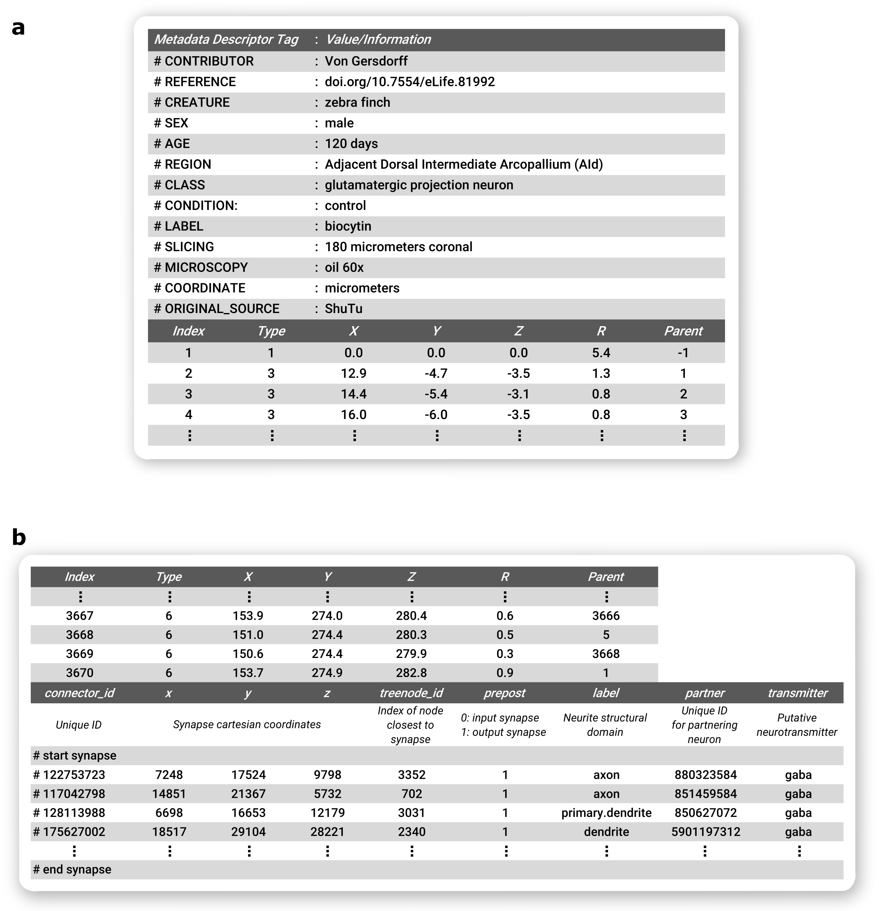

swc_specification
=================

Information about the SWC file specification. A video describing the 
specification can be found here: https://vimeo.com/853224668?share=copy

Specification of standard SWC - adapted from (3)
------------------------------------------------

An SWC file (S.W.C. encodes for the last names of its initial designers
Ed Stockley, Howard Wheal, and Robert Cannon) is a text file that starts
with an optional header section in which each line starts with the
symbol #. Some SWC-variants use this section to store information about
the data in an orderly fashion, others treat is as a free-text field.

Below the header section, a points matrix with 7 columns follows. It
contains the points traced along the neuronal tree. The seven numbers in
each row are separated by spaces, and have the following meaning:

============ ====== =================================================
Column index Field  Description
============ ====== =================================================
1            Index  Sample identifier. A sequential positive integer.
2            Type   Type identifier. A positive integer.
3            X      X-position in micrometers
4            Y      Y-position in micrometers
5            Z      Z-position in micrometers
6            R      Radius in micrometers (half the node thickness)
7            Parent Parent sample identifier.
============ ====== =================================================

The basic set of types used in NeuroMorpho.org SWC files are: 

==================== ====== =========================================
Type                 ID     Description
==================== ====== =========================================
undefined            0      Structure type unknown or unspecified
soma                 1      Soma of a neuron
axon                 2      Axon of a neuron
basal dendrite       3      Basal dendrite of a neuron
apical dendrite      4      Apical dendrite of a neuron
custom               5      Custom type of cell component
unspecified neurite  6      An unspecified part of a neuron
glia processes       7      Glial processes
custom               >7     Custom type of cell component
==================== ====== =========================================

Parent defines how points are connected to each other. In a tree,
multiple points can have the same ParentID. The first point in the file
must have a ParentID equal to -1, which represents the root point.
Parent samples must be defined before they are being referred to. By
counting how many points refer to the a given parent, the number of its
children can be computed.

Soma representation
-------------------

The soma in SWC can consist of a single root point or multiple points,
the first of which is the root. The single-point representation
approximates the soma as a sphere of radius R and centered in X, Y, Z.
The multi-point representation approximates the soma as a sequence of
nodes akin to a neurite branch. Note that representing the soma as a
contour tracing of the soma perimeter or a series of contour tracings
approximating the soma surface is not consistent with the SWC standard.

SWC Example - adapted from Ascoli et al, 2001
---------------------------------------------

.. figure:: https://user-images.githubusercontent.com/8552673/157725540-a49e8ab7-e930-401c-938b-713dd093dc2c.png
   :alt: image

   image

This extremely simplified neuronal structure was obtained by extensive
pruning of a dentate gyrus granule cell in (4). The left panel shows the
digital SWC representation: every node compartment is described by a row
containing: - A label (ID or Index, the same numbers reported next to
the branches in the right panel - A tag (T or Type, 1 for soma, 3 for
dendrite), - Cartesion positions (X,Y,Z in micrometers), - Radius (R)
and - Connectivity (C or Parent, representing the label of parent, -1
indicates no parent)

Syntax of basic SWC reconstruction in `EBNF <https://en.wikipedia.org/wiki/Extended_Backus%E2%80%93Naur_form>`__ - from Nanda et al, 2018
-----------------------------------------------------------------------------------------------------------------------------------------

newline = “:raw-latex:`\n`” ;

letter = “A” \| “B” \| “C” \| “D” \| “E” \| “F” \| “G” \| “H” \| “I” \|
“J” \| “K” \| “L” \| “M” \| “N” \| “O” \| “P” \| “Q” \| “R” \| “S” \|
“T” \| “U” \| “V” \| “W” \| “X” \| “Y” \| “Z” \| “a” \| “b” \| “c” \|
“d” \| “e” \| “f” \| “g” \| “h” \| “i” \| “j” \| “k” \| “l” \| “m” \|
“n” \| “o” \| “p” \| “q” \| “r” \| “s” \| “t” \| “u” \| “v” \| “w” \|
“x” \| “y” \| “z” ;

digit = “0” \| “1” \| “2” \| “3” \| “4” \| “5” \| “6” \| “7” \| “8” \|
“9” ;

symbol = “[" \| "]” \| “{” \| “}” \| “(” \| “)” \| “<” \| “>” \| “‘"
\|’”’ \| “=” \| “\|” \| “.” \| “,” \| “;” ;

integer = [+|-] digit{digit} ;

double = integer [“.”] {integer} ;

character = letter \| double \| symbol \| "_" \| " ";

header = “#” character {character} newline [“#” character {character}
newline] ;

Index = integer ;

Type = integer ;

X = double ;

Y = double ;

Z = double ;

Radius = double ;

Parent = integer ;

node = Index " " Type " " X " " Y " " Z " " Radius " " Parent ;

neuron_tree = node newline {node newline} ;

SWC = [header] neuron_tree ;

Header fields defined in Cannon et al 1998
------------------------------------------

The original publication that introduced SWC (4) described the header as
containing the following fields, although these are not considered a
required component of SWC:

+----------------------+----------------------------------------------+
| Field                | Description                                  |
+======================+==============================================+
| ORIGINAL_SOURCE      | File type delivered by digitisation          |
|                      | equipment                                    |
+----------------------+----------------------------------------------+
| CREATURE             | Species from which the cell came             |
+----------------------+----------------------------------------------+
| REGION               | Brain region                                 |
+----------------------+----------------------------------------------+
| FIELD/LAYER          | Location within region                       |
+----------------------+----------------------------------------------+
| TYPE                 | Cell type                                    |
+----------------------+----------------------------------------------+
| CONTRIBUTOR          | Name, initials, organisation, e.g. Turner    |
|                      | DA, Duke                                     |
+----------------------+----------------------------------------------+
| REFERENCE            | Where the data has been published            |
+----------------------+----------------------------------------------+
| RAW                  | File name of original data                   |
+----------------------+----------------------------------------------+
| EXTRAS               | Files containing further information on this |
|                      | cell                                         |
+----------------------+----------------------------------------------+
| SOMA_AREA            | Area of soma (in mm2)                        |
+----------------------+----------------------------------------------+
| SHRINKAGE_CORRECTION | x, y and z correction factors                |
+----------------------+----------------------------------------------+
| VERSION_NUMBER       | To identify different versions of the same   |
|                      | raw data                                     |
+----------------------+----------------------------------------------+
| VERSION_DATE         | Date this version was created (yyyy-mm-dd)   |
+----------------------+----------------------------------------------+
| SCALE                | Used internally to record applied shrinkage  |
|                      | corrections                                  |
+----------------------+----------------------------------------------+

Recommendations for Optional Inclusion of Ancillary Information
----------------------------------------------------------------
Individual researchers may choose to specify additional details in the header
or footer of the SWC file, see figure below. In particular, the header is 
most commonly employed to relay metadata information, as originally proposed. 
Since many of the same metadata elements are frequently employed across studies, 
we provide here our suggestions based on the most common annotations in use at
NeuroMorpho.Org. Specifically, one or more lines starting with the “#” sign 
should convey the following information, if known: the name of the author(s),
dataset, or lab of origin (#contributor); DOI or full bibliographic citation
for document describing data (#reference); the animal species and strain or 
genotype (#creature), sex (#sex), age (#age), and weight (#weight); the 
anatomical region of the cell body (#region) and the cell type or identifying 
features (#class); the experimental group (#condition); the labeling or staining 
(#label); the slicing direction and thickness (#slicing); the objective type and
magnification (#microscopy); the physical units (#coordinate), reference frame
(#brainspace), and the tracing software (#original_source). It is important to
recognize that the above list cannot capture, nor is it always applicable to,
all essential details of each neuroanatomy study. Moreover, to truly standardize
metadata it would be necessary to define not only the required fields, but also
a set of controlled vocabularies to describe the corresponding details. Recent
developments in machine learning can greatly facilitate this process.

A second opportunity for increasing the applicability of SWC files is to utilize
the footer to convey information regarding synaptic connectivity. Here we adopt
the format recently proposed by the fly electron microscopy community. 
Accordingly, the synaptic connectivity in the SWC file footer should begin with
a “#start synapse” line and finish with an “#end synapse” line. These delimiters
are useful to avoid accidentally reading as synapses other cellular information
that users might want to include in the footer, such as organelle distributions
or temporal branch dynamics. In between, each line should describe a synaptic
contact with a “#” sign followed by 9 fields: (i) a unique ID for the detected
synapse; (ii-iv) the x, y, and z synapse position in coordinate space; (v) the
node in the SWC file closest to the synapse; (vi) a binary assignment with 0
indicating an output synapse and 1 indicating an input synapse; (vii) the
neurite structural domain, e.g., axon vs. dendrite, analogous to the second
data field (type) in the SWC data file; (viii) a unique identifier for the
partnering neuron; and (ix) the putative neurotransmitter. Prior to the first
synapse data line, a line (always starting with “#”) should list the meaning
of these fields.

The above information could be parsed automatically by suitable connectomics
analysis platforms. At the same time, because traditional SWC readers interpret
the “#” as a comment indicator, the proposed header and footer formats ensure
continuous back-compatibility with legacy software.

   Recommended optional inclusion of ancillary information in SWC Files. a Metadata information included as a header, b Synapse connectivity information in footer.

References
----------

1. Ascoli GA, Krichmar JL, Nasuto SJ, Senft SL. Generation, description
   and storage of dendritic morphology data. Philos Trans R Soc Lond B
   Biol Sci. 2001;356(1412):1131-1145. doi:10.1098/rstb.2001.0905
   (`PMCID:
   PMC1088507 <https://www.ncbi.nlm.nih.gov/sites/ppmc/articles/PMC1088507/>`__)
2. Nanda S, Chen H, Das R, et al. Design and implementation of
   multi-signal and time-varying neural reconstructions. Sci Data.
   2018;5:170207. Published 2018 Jan 23. doi:10.1038/sdata.2017.207
   (`PMCID:
   PMC5779069 <https://www.ncbi.nlm.nih.gov/sites/ppmc/articles/PMC5779069/>`__)
3. https://neuroinformatics.nl/swcPlus/ “SWC plus (SWC+) format
   specification”
4. Cannon RC, Turner DA, Pyapali GK, Wheal HV. An on-line archive of
   reconstructed hippocampal neurons. Journal of Neuroscience Methods.
   1998 Oct;84(1-2):49-54. DOI: 10.1016/s0165-0270(98)00091-0. `PMID:
   9821633 <https://europepmc.org/article/MED/9821633>`__.
5. https://en.wikipedia.org/wiki/Extended_Backus%E2%80%93Naur_form
6. http://neuromorpho.org/SomaFormat.html Soma format representation in
   NeuroMorpho.Org as of version 5.3

Contributors
------------

-  Lydia Ng
-  Giorgio Ascoli
-  Bengt Ljungquist
-  Sumit Nanda
